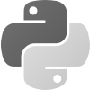
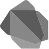
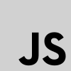
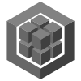
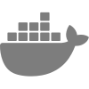

<table>
  <tr>
    <td width="34%" valign="middle">

    </td>
    <td width="48%" valign="middle">

<h1>Kevin S. F. García</h1>

<strong>Jr. Software Engineering · Backend Systems · Mobile</strong>

<p>
I build maintainable software with a strong focus on backend architecture,
application security, and systems that are easy to understand and evolve.
</p>

<p>
<code>Mexico</code> · <code>Software Engineering</code>
</p>

<p>
<a href="https://overnuke.github.io/personal-portfolio/">Portfolio</a> ·
<a href="https://www.linkedin.com/in/keffwontwakeup/">LinkedIn</a> ·
<a href="mailto:ksfgarcia24@gmail.com">Email</a>
</p>

## Currently

```text
LEARNING  → AI for Future Workforce — GenAI
PROGRAM   → Public AI Training Center
```
  </tr>
</table>

---

## Some of my Work

<table width="100%">
  <tr>
    <td width="50%" valign="top">
      <h3><code>BARBERSHOP</code></h3>
      <p>Backend system for appointment scheduling and business operations.</p>
      <p><strong>Node.js · Express · Sequelize · MySQL · Docker · Vitest</strong></p>
<pre>Routes
   │
   ▼
Controllers
   │
   ▼
Services
   │
   ▼
Repositories
   │
   ▼
Sequelize
   │
   ▼
MySQL
</pre>
      <p>Built around a layered architecture with scheduling rules, barber availability,
appointment collision detection, role-based operations, notifications, and automated tests.</p>
      <p>→ <a href="https://github.com/Sinhularity/barbershop">Explore project</a></p>
    </td>
    <td width="50%" valign="top">
      <h3><code>DOCUMENT'S MODULE</code></h3>
      <p>Document access-control system built on top of Odoo.</p>
      <p><strong>Python · Odoo · OWL · Access Control</strong></p>
<pre>                 ┌──────────┐
                 │   User   │
                 └────┬─────┘
                      │
                 ┌────▼─────┐
                 │  Groups  │
                 └────┬─────┘
                      │
              ┌───────┴────────┐
              ▼                ▼
           VIEW              WRITE
              │                │
              └───────┬────────┘
                      ▼
              documents.document
</pre>
      <p>Focused on folder visibility, read/write groups, permission propagation,
auditing, and maintainable access-control rules.</p>
    </td>
  </tr>
  <tr>
    <td colspan="2" align="center">
      <table width="70%">
        <tr>
          <td align="center">
            <h3><code>ACOPIATECH</code></h3>
            <p><strong>3rd Place at ANFECA's XIX Regional Entrepreneurial Expo</strong></p>
            <p>Mobile application developed as part of an entrepreneurial project and presented
at ANFECA's regional competition.</p>
            <p>→ <a href="https://github.com/Sinhularity/acopiatech-app">Source</a></p>
          </td>
        </tr>
      </table>
    </td>
  </tr>
</table>

---

## Stack

<p align="center">
<kbd><picture><source media="(prefers-color-scheme: dark)" srcset="assets/tech-icons/python-white.svg"><source media="(prefers-color-scheme: light)" srcset="assets/tech-icons/python-gray.svg"></picture>&nbsp;Python</kbd>
<kbd><picture><source media="(prefers-color-scheme: dark)" srcset="assets/tech-icons/nodejs-white.svg"><source media="(prefers-color-scheme: light)" srcset="assets/tech-icons/nodejs-gray.svg"></picture>&nbsp;Node.js</kbd>
<kbd><picture><source media="(prefers-color-scheme: dark)" srcset="assets/tech-icons/express-white.svg"><source media="(prefers-color-scheme: light)" srcset="assets/tech-icons/express-gray.svg"></picture>&nbsp;Express</kbd>
<kbd><picture><source media="(prefers-color-scheme: dark)" srcset="assets/tech-icons/odoo-white.svg"><source media="(prefers-color-scheme: light)" srcset="assets/tech-icons/odoo-gray.svg"></picture>&nbsp;Odoo</kbd>
<kbd><picture><source media="(prefers-color-scheme: dark)" srcset="assets/tech-icons/java-white.svg"><source media="(prefers-color-scheme: light)" srcset="assets/tech-icons/java-gray.svg"></picture>&nbsp;Java</kbd>
<kbd><picture><source media="(prefers-color-scheme: dark)" srcset="assets/tech-icons/flutter-white.svg"><source media="(prefers-color-scheme: light)" srcset="assets/tech-icons/flutter-gray.svg"></picture>&nbsp;Flutter</kbd>
<kbd><picture><source media="(prefers-color-scheme: dark)" srcset="assets/tech-icons/dart-white.svg"><source media="(prefers-color-scheme: light)" srcset="assets/tech-icons/dart-gray.svg"></picture>&nbsp;Dart</kbd>
<kbd><picture><source media="(prefers-color-scheme: dark)" srcset="assets/tech-icons/javascript-white.svg"><source media="(prefers-color-scheme: light)" srcset="assets/tech-icons/javascript-gray.svg"></picture>&nbsp;JavaScript</kbd>
<kbd><picture><source media="(prefers-color-scheme: dark)" srcset="assets/tech-icons/mysql-white.svg"><source media="(prefers-color-scheme: light)" srcset="assets/tech-icons/mysql-gray.svg"></picture>&nbsp;MySQL</kbd>
<kbd><picture><source media="(prefers-color-scheme: dark)" srcset="assets/tech-icons/sequelize-white.svg"><source media="(prefers-color-scheme: light)" srcset="assets/tech-icons/sequelize-gray.svg"></picture>&nbsp;Sequelize</kbd>
<kbd><picture><source media="(prefers-color-scheme: dark)" srcset="assets/tech-icons/react-white.svg"><source media="(prefers-color-scheme: light)" srcset="assets/tech-icons/react-gray.svg"></picture>&nbsp;React</kbd>
<kbd><picture><source media="(prefers-color-scheme: dark)" srcset="assets/tech-icons/owl-white.svg"><source media="(prefers-color-scheme: light)" srcset="assets/tech-icons/owl-gray.svg"></picture>&nbsp;OWL</kbd>
<kbd><picture><source media="(prefers-color-scheme: dark)" srcset="assets/tech-icons/html-white.svg"><source media="(prefers-color-scheme: light)" srcset="assets/tech-icons/html-gray.svg"></picture>&nbsp;HTML</kbd>
<kbd><picture><source media="(prefers-color-scheme: dark)" srcset="assets/tech-icons/css-white.svg"><source media="(prefers-color-scheme: light)" srcset="assets/tech-icons/css-gray.svg"></picture>&nbsp;CSS</kbd>
<kbd><picture><source media="(prefers-color-scheme: dark)" srcset="assets/tech-icons/docker-white.svg"><source media="(prefers-color-scheme: light)" srcset="assets/tech-icons/docker-gray.svg"></picture>&nbsp;Docker</kbd>
<kbd><picture><source media="(prefers-color-scheme: dark)" srcset="assets/tech-icons/git-white.svg"><source media="(prefers-color-scheme: light)" srcset="assets/tech-icons/git-gray.svg"></picture>&nbsp;Git</kbd>
</p>

---
